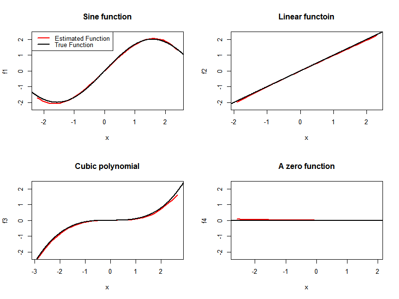
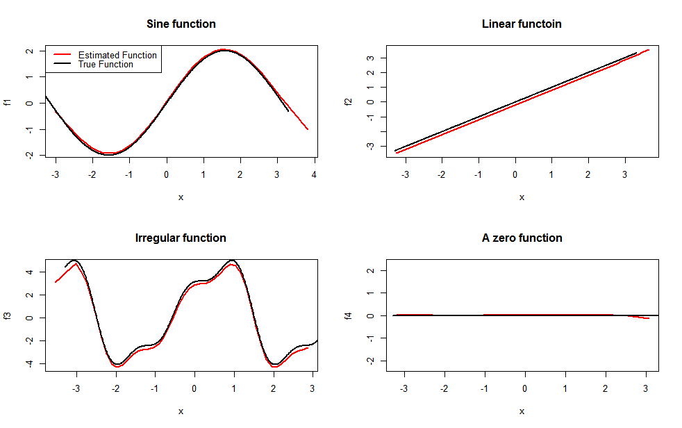

# R package: HierBasis

The main aim of `HierBasis` is to provide a user-friendly interface for non-parametric regression and sparse additive modeling. The main functions of the package can be divided into sections:

1. Univariate non-parametric regression
      + `HierBasis`: Univariate non-parametric regression.
      + `predict.HierBasis`: Predictions based on fitted models.
      + `GetDoF.HierBasis`: Effective degrees of freedom of fitted models.
2. High dimensional sparse additive regression
      + `AdditiveHierBasis`: Sparse additive modeling.
      + `predict.addHierBasis`: Predictions based on fitted additive models.
      + `plot.addHierBasis`: Plots of fitted component function.

#####Requirements
- `R (>=3.2.0)`
- `Rcpp (>=0.12.0)`
- `RcppArmadillo`
- `Matrix`

#####Updates
- 2016/05/12 Version 0.1.0 released.
- 2016/05/26 Version 0.2.2 released. Substantially faster by moving some matrix calculations to c++.

#####Future Work
- Speed-up of algorithms using an active set strategy.
- Implementation of `AdditiveHierBasis` via a proximal gradient descent.
- Parallel implementation of `AdditiveHierBasis`.


-------------------------------------------------------------------------

##Key Features
###1. Ease of use: 
The function `HierBasis` requires only a numeric vector `x` and a vector `y` of response values.

```R
library(HierBasis)
set.seed(1)

# Generate the points x.
n <- 300
x <- (1:300)/300

# A simple quadratic function.
y <- 5 * (x - 0.5)^2
ydat <- y + rnorm(n, sd = 0.1)

fit <- HierBasis(x, ydat, nlam = 10)

> fit
Call:  HierBasis(x = x, y = ydat, nlam = 10) 

        Lambda Deg.of.Poly
 [1,] 5.40e-02           0
 [2,] 1.94e-02           2
 [3,] 6.97e-03           2
 [4,] 2.51e-03           2
 [5,] 9.01e-04           2
 [6,] 3.24e-04           2
 [7,] 1.16e-04           3
 [8,] 4.18e-05           5
 [9,] 1.50e-05           9
[10,] 5.40e-06          12
```

A generic S3 method for making predictions.
```R
new.x <- runif(10)
yhat.new <- predict(fit, new.x = new.x)

# Fitting the 4th lambda value, lambda = 2.51e-03.
plot(x, ydat, type = "p", ylab = "y")
lines(x, y, lwd = 2)
lines(x, fit$fitted.values[, 4], col = "red", lwd = 2)

points(new.x, yhat.new[, 4], cex = 1.5, pch = 16, col = "red")
abline(v = new.x, lty = 2)
```


The `AdditiveHierBasis` function allows us to fit sparse additive models. As before we really only need a design matrix `x` and response vector `y`. In addition for additive models we do not automatically select `max.lambda` value and this must be specified.

```R
set.seed(1)

# Generate the points x.
n <- 100
p <- 6

x <- matrix(rnorm(n * p), ncol = p)

# A simple model with 3 non-zero functions.
y <- rnorm(n, sd = 0.1) + 2 * sin(x[, 1]) + x[, 2] + (x[, 3])^3/10

fit.additive <- AdditiveHierBasis(x, y, max.lambda = 30)
```

An S3 `plot` function allows to easily plot individual component functions. Continuing the above example we plot the first four component functions along with the true functions for the 30th lambda value. 

```R
par(mfrow = c(2,2))
plot(fit.additive, ind.lam = 30, ind.func = 1,
     xlab = "x", ylab = "f1", main = "Sine function",
     type = "l", col = "red", lwd = 2, ylim = c(-2.3, 2.3))

xs <- seq(-3, 3, length = 500)
lines(xs, 2 * sin(xs), lwd = 2)
legend("topleft", c("Estimated Function", "True Function"),
       col = c("red", "black"), lwd = 2, lty = 1)

plot(fit.additive, ind.lam = 30, ind.func = 2,
     xlab = "x", ylab = "f2", main = "Linear functoin",
     type = "l", col = "red", lwd = 2,
     ylim = c(-2.3, 2.3))
lines(xs, (xs), lwd = 2)

plot(fit.additive, ind.lam = 30, ind.func = 3,
     xlab = "x", ylab = "f3", main = "Cubic polynomial",
     type = "l", col = "red", lwd = 2,
     ylim = c(-2.3, 2.3))
lines(xs, (xs)^3/10, lwd = 2)

plot(fit.additive, ind.lam = 30, ind.func = 4,
     xlab = "x", ylab = "f4", main = "A zero function",
     type = "l", col = "red", lwd = 2,
     ylim = c(-2.3, 2.3))
lines(xs, 0 * xs, lwd = 2)
```



###2. Adaptibility:
One of the main features of our method is the ability to adapt to varying degree of function complexity. This becomes increasingly important for additive models where some functions may be linear and some may be highly irregular. We repeat the above example replacing the sine function with a more irregular function. We increase the number of basis functions used for model fitting however we notice that additive HierBasis can adapt to varying levels of complexity. 



###3. Parsimonious Representation:
Not only can we adapt to varying degrees of complexity, the package also contains functions for displaying the fitted models. We note that each function is a polynomial of degree at-most \code{nbasis} however, the hierarchical penalty leads to sparsity in the coefficients of the polynomial representation. This gives us a parsimonious representation for our fitted model which we can view as follows:
```R
> print(fit.additive, lam.index = 30)

Call:  AdditiveHierBasis(x = x, y = y, nbasis = 30, max.lambda = 30) 

[[1]]
30 x 6 sparse Matrix of class "dgCMatrix"
                                                              
 [1,]  1.99e+00 0.99300  2.03000  0.003390  1.41e-02  0.000949
 [2,]  6.38e-03 0.00464 -4.18000 -0.009700  1.20e-03 -0.000576
 [3,] -3.23e-01 0.00356  5.93000  0.000455 -4.68e-03 -0.002010
 [4,]  1.16e-03 .        5.05000  0.001200  8.48e-05  0.000333
 [5,]  1.30e-02 .       -6.69000 -0.000160  .         .       
 [6,] -2.44e-04 .       -3.69000 -0.000106  .         .       
 [7,] -6.57e-05 .        2.60000  .         .         .       
 [8,]  .        .        1.21000  .         .         .       
 [9,]  .        .       -0.47900  .         .         .       
[10,]  .        .       -0.19700  .         .         .       
[11,]  .        .        0.04240  .         .         .       
[12,]  .        .        0.01580  .         .         .       
[13,]  .        .       -0.00145  .         .         .       
[14,]  .        .       -0.00050  .         .         .       
[15,]  .        .        .        .         .         .       
[16,]  .        .        .        .         .         .       
[17,]  .        .        .        .         .         .       
[18,]  .        .        .        .         .         .       
[19,]  .        .        .        .         .         .       
[20,]  .        .        .        .         .         .       
[21,]  .        .        .        .         .         .       
[22,]  .        .        .        .         .         .       
[23,]  .        .        .        .         .         .       
[24,]  .        .        .        .         .         .       
[25,]  .        .        .        .         .         .       
[26,]  .        .        .        .         .         .       
[27,]  .        .        .        .         .         .       
[28,]  .        .        .        .         .         .       
[29,]  .        .        .        .         .         .       
[30,]  .        .        .        .         .         .       

> view.model.addHierBasis(fit.additive, lam.index = 30)
[[1]]
[1] "1.99x^1"      "0.00638x^2"   "-0.323x^3"    "0.00116x^4"   "0.013x^5"     "-0.000244x^6" "-6.57e-05x^7"

[[2]]
[1] "0.993x^1"   "0.00464x^2" "0.00356x^3"

[[3]]
 [1] "2.03x^1"      "-4.18x^2"     "5.93x^3"      "5.05x^4"      "-6.69x^5"     "-3.69x^6"     "2.6x^7"       "1.21x^8"      "-0.479x^9"    "-0.197x^10"  
[11] "0.0424x^11"   "0.0158x^12"   "-0.00145x^13" "-5e-04x^14"  

[[4]]
[1] "0.00339x^1"   "-0.0097x^2"   "0.000455x^3"  "0.0012x^4"    "-0.00016x^5"  "-0.000106x^6"

[[5]]
[1] "0.0141x^1"   "0.0012x^2"   "-0.00468x^3" "8.48e-05x^4"

[[6]]
[1] "0.000949x^1"  "-0.000576x^2" "-0.00201x^3"  "0.000333x^4" 

```

###4. Scalability:
The algorithms presented here can handle substantially larger amounts of data within reasonable time. For example, for the original univariate example we now consider the case of 10,000 observations where we allow at-most 300 basis functions (a polynomial of degree at-most 300).
```R
set.seed(1)

# Generate the points x.
n <- 1e+4
x <- (1:n)/n

# A simple quadratic function.
y <- 5 * (x - 0.5)^2
ydat <- y + rnorm(n, sd = 0.1)

> system.time(fit <- HierBasis(x, ydat, nlam = 10, nbasis = 300))
   user  system elapsed 
   8.11    0.25    8.49 
```


-------------------------------------------------------------------------

##Installation
Run `devtools::install_github("asadharis/HierBasis")` latest development version.

-------------------------------------------------------------------------
##Acknowledgements 
I would like to express my deep gratitude to Professor Ali Shojaie and Noah Simon, my research supervisors, for their patient guidance, enthusiastic encouragement and useful critiques of this project.
